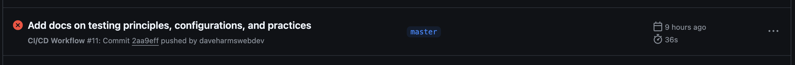

# So What?!?

In my 8 - 9 years or doing this, very few projects took unit testing seriously.  One project stands out.  And that was an app wher you could pay your taxes electronically.  In other words it was regulated by the IRS and it involved the customers money.

Most projects that I have been on did require unit testing.  If it did it did not demand coverage. And unit testing was never part of the CI/CD pipeline.

## Coverage

```text
-------------------------------------|---------|----------|---------|---------|-------------------
File                                 | % Stmts | % Branch | % Funcs | % Lines | Uncovered Line #s 
-------------------------------------|---------|----------|---------|---------|-------------------
All files                            |   77.63 |    88.13 |      60 |   77.63 |                   
 src                                 |       0 |        0 |       0 |       0 |                   
  app.ts                             |       0 |        0 |       0 |       0 | 1-15              
  server.ts                          |       0 |        0 |       0 |       0 | 1-10              
 src/controllers                     |      70 |    92.85 |   57.14 |      70 |                   
  actor.controller.ts                |   71.42 |      100 |      60 |   71.42 | 59-71,74-84       
  film.controller.ts                 |   65.38 |       75 |      50 |   65.38 | 18-26             
 src/controllers/helpers             |     100 |      100 |     100 |     100 |                   
  createResponse.ts                  |     100 |      100 |     100 |     100 |                   
 src/libs                            |     100 |      100 |     100 |     100 |                   
  prisma.ts                          |     100 |      100 |     100 |     100 |                   
 src/middleWares                     |       0 |        0 |       0 |       0 |                   
  errorHandler.ts                    |       0 |        0 |       0 |       0 | 1-20              
  validate-request.ts                |       0 |        0 |       0 |       0 | 1-17              
 src/models                          |       0 |        0 |       0 |       0 |                   
  IResponse.ts                       |       0 |        0 |       0 |       0 | 1-5               
 src/services                        |   97.67 |    93.75 |      60 |   97.67 |                   
  actor.service.ts                   |     100 |    93.75 |     100 |     100 | 75                
  film.service.ts                    |      75 |      100 |       0 |      75 | 5,8               
 src/services/helpers/actors         |     100 |      100 |     100 |     100 |                   
  actor.mappers.ts                   |     100 |      100 |     100 |     100 |                   
  fetchAllActorsWithFilmCountArgs.ts |     100 |      100 |     100 |     100 |                   
  getActorFindManyArgs.ts            |     100 |      100 |     100 |     100 |                   
  getActorFindUniqueArgs.ts          |     100 |      100 |     100 |     100 |                   
 src/services/helpers/films          |     100 |      100 |     100 |     100 |                   
  getFilmFindManyArgs.ts             |     100 |      100 |     100 |     100 |                   
  getFilmFindUniqueArgs.ts           |     100 |      100 |     100 |     100 |                   
 src/validators                      |     100 |      100 |     100 |     100 |                   
  actor.validator.ts                 |     100 |      100 |     100 |     100 |                   
-------------------------------------|---------|----------|---------|---------|-------------------

```

The flag we add is `--coverage`.  Documentation can be found [here](https://jestjs.io/docs/cli#--coverageboolean).

This demo project is placing those options in the jest config file.

```js
const config = {
    preset: 'ts-jest',
    testEnvironment: 'node',
    
    
    // start coverage config here
    
    collectCoverage: true,
    coverageDirectory: 'coverage',
    coverageProvider: 'v8',
    collectCoverageFrom: [
        'src/**/*.ts', // Collects coverage from all source files
        '!src/routes/**',
        '!src/tests/**', // Excludes test files from coverage
        '!**/*.d.ts', // Excludes TypeScript declaration files
    ],
    
    // end coverage config
    
    transform: {
        '^.+\\.tsx?$': [
            'ts-jest',
            {
                tsconfig: 'tsconfig.tests.json', // Use the test-specific config
            },
        ],
    },
    testMatch: ['<rootDir>/tests/unit/**/*.unit.spec.ts'],
    rootDir: './',
    moduleDirectories: [
        'node_modules',
        '<rootDir>/src', // Allows imports from the src directory without relative paths
    ],
    moduleNameMapper: pathsToModuleNameMapper(compilerOptions.paths, { prefix: '<rootDir>/'}),
};
```

In the coverage directory you will find a browsable report.

## Some files don't have coverage.  So what?

We can add a coverage threshold to the config.js file

```js
  coverageThreshold: {
    global: {
      branches: 80, // Require 80% of branch coverage
      functions: 80, // Require 80% of function coverage
      lines: 80, // Require 80% of line coverage
      statements: 80, // Require 80% of statement coverage
    },
  },
```

We add a coverage threshold and rerun the tests and we get these results:

```
Jest: "global" coverage threshold for statements (80%) not met: 77.63%
Jest: "global" coverage threshold for lines (80%) not met: 77.63%
Jest: "global" coverage threshold for functions (80%) not met: 60%
```

We can implement this threshold in the build process.

```yaml
name: CI/CD Workflow

on:
  push:
    branches:
      - master

jobs:
  test:
    runs-on: ubuntu-latest

    steps:
      - name: Check out the code
        uses: actions/checkout@v4.2.2

      - name: Cache Node.js modules
        uses: actions/cache@v3
        with:
          path: ~/.npm
          key: ${{ runner.os }}-node-${{ hashFiles('**/package-lock.json') }}
          restore-keys: |
            ${{ runner.os }}-node-

      - name: Set up Node.js
        uses: actions/setup-node@v4.1.0
        with:
          node-version: '20.17'

      - name: Install dependencies
        run: npm install

      - name: Copy .env.test to .env
        run: cp .env.test .env

      - name: Run Unit Tests
        run: npm test

      - name: Set up Docker Compose for integration tests
        run: docker compose -f docker-compose.test.yml up -d

      - name: Wait for database to be ready
        run: |
          echo "Waiting for the database to be ready..."
          for i in {1..10}; do
            if pg_isready -h localhost -p 5433 -U postgres; then
              echo "Database is ready!" 
              break
            fi
            echo "Database is not ready yet... retrying in 2s"
            sleep 2
            if [ $i -eq 10 ]; then
              echo "Error: Database not ready after 10 attempts"
              exit 1
            fi
          done

      - name: Apply Prisma Migrations
        run: |
          echo "Applying Prisma migrations..."
          npx prisma migrate deploy

      - name: Run integration tests
        run: npx jest --config jest.integration.config.js

      - name: Get Docker Compose Logs (on failure)
        if: failure()
        run: docker compose -f docker-compose.test.yml logs

      - name: Tear down Docker Compose
        if: always()
        run: docker compose -f docker-compose.test.yml down

  build:
    if: github.ref == 'refs/heads/master'
    needs: test
    runs-on: ubuntu-latest

    steps:
      - name: Check out the code
        uses: actions/checkout@v4.2.2

      - name: Set up Node.js
        uses: actions/setup-node@v4.1.0
        with:
          node-version: '20.17'

      - name: Install dependencies
        run: npm install

      - name: Build application
        run: npm run build
```

The results of failing the threshold would be that the task stops and subsequent tasks are cancelled (because of the "needs" clause).



### Failed Threshold


## But Why Wait


You could automatically run that check with Husky during a pre-commit hook.

Very easy to do. https://typicode.github.io/husky/

Here is an example of husky blocking a commit due to a failed test.


